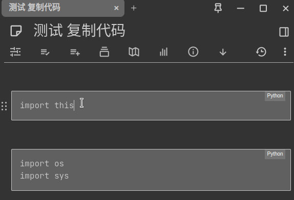

# Copy Code Block Widget

[中文说明](README_CN.md)

Please stand up and stretch your body for a while if you see this :)

Hello! If you appreciate my creations, kindly consider [backing me](#-donation). Your support is greatly appreciated. Thank you!

**Enhance Your Experience**

Copy code block widget for Trilium. Double click to copy code block content in Trilium.

# Screenshots

## Double click to copy

## Multi-language support

# How to Install

1. Download the zip file from the [release page](https://github.com/Nriver/tomato-timer-widget/releases).
2. Right-click note tree in Trilium and click import, uncheck `Safe Import`.
3. Restart Trilium Notes or use `ctrl+r` to reload the interface.
4. Open a `Text` note, double-click on the code block.
5. Have fun.

# Hints

1. You can tweak configs in the `config` subnote.
2. i18n support, check the `translations` subnote for the translated texts.
3. There will be a notification telling you have successfully copied the code block :)

# Why I Made This?

There is no copy button in Trilium due to the upstream CKEditor's lack of this feature. The related issue https://github.com/ckeditor/ckeditor5/issues/9774 has not been touched for 3 years until now. I would assume this won't be fixed in the upstream. So, I made an implementation by myself.

# Donation

Ko-fi:  

Alipay:  

WeChat Pay:  

