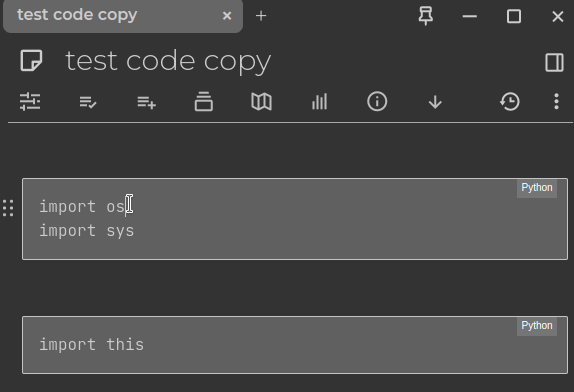
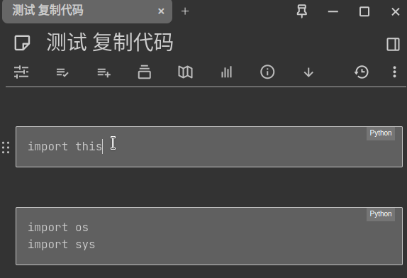

# 复制代码块小部件

[English README](README.md)

如果您看到这个，请站起来伸展一下身体 :)

您好！如果您喜欢我的作品，请考虑[支持我](#捐赠)。非常感谢您的支持。谢谢！

**提升您的体验**

Trilium的代码块复制小部件。在Trilium中双击以复制代码块内容。

# 截图

## 双击以复制

## 多语言支持

# 如何安装

1. 从[发布页面](https://github.com/Nriver/copy-code-block-widget/releases)下载zip文件。
2. 在Trilium中右键单击笔记树，然后单击导入，取消选中“安全导入”。
3. 重新启动Trilium Notes或使用`ctrl+r`重新加载界面。
4. 打开一个`Text`笔记，在代码块上双击。
5. 玩得开心。

# 提示

1. 您可以在`config`子笔记中调整配置。
2. 支持i18n，查看`translations`子笔记以获取翻译文本。
3. 将会有通知告诉您已成功复制了代码块 :)

附注：如果这个小部件在您的客户端或网页浏览器中无法正常工作，请尝试在config中增加executeDelay以更好地适应您的设置。

# 我为什么制作这个？

由于上游CKEditor缺乏此功能，Trilium中没有复制按钮。相关问题 https://github.com/ckeditor/ckeditor5/issues/9774 在过去3年中都没有被解决。我认为这个问题不会在上游得到解决。因此，我自己实现了这个功能。

# 捐赠

Ko-fi：  

支付宝：  

微信支付：  

